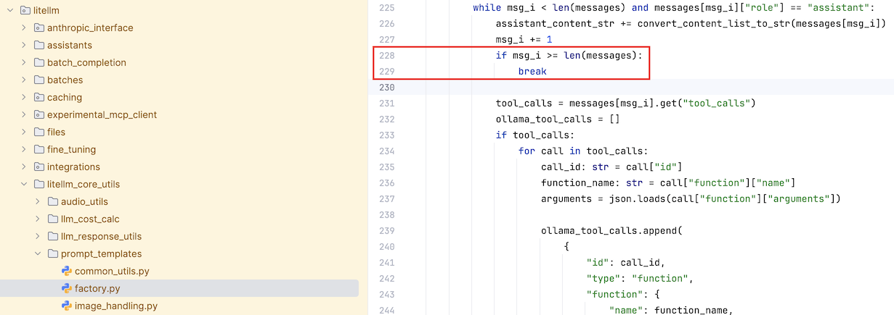

# Atlantic Hackathon 2025

## Team

- Declan Joyce
- Lorna Kelleher
- Micheal Ryan
- Simon O'Doherty

---
## Purpose

HAL (Health Advisor Lead) is an AI tool that aims to be part of a wider solution to help carers combat the challenges in caring for the valued elderly population.

---
## Installing

**Note:** If you get issues installing/running, check the "Issues" section further down before you start changing/breaking things. 

1. Install [Python version 3.11.*](https://www.python.org/downloads/) (3.11.9 tested)
2. Run: `pip install --upgrade -r requirements.txt`
3. Copy `template.env` to `.env`
4. Edit the `.env` file and update settings as required. 
   - The `#` means the line is commented out. Remove it if you need to use that setting.

### Using Ollama: 
There is a current issue where tools fail in ollama. 
**(See issues section for fix)**

1. Install [Ollama](https://ollama.com).
2. from terminal also run: `ollama pull granite3.3`
3. Optionally change `granite3.3` to the model you picked in your `.env` file.

### Using watsonx.ai 
1. Go to your watsonx.ai prompt lab.
2. Select the model you want to work with.
3. Click the `</>` icon. This will display the raw code.
4. From that get: 
   - `WATSONX_URL` : The start of the endpoint url.
   - `WATSONX_PROJECT_ID` : This is the `project_id`. 
   - `MODEL` : The model in watsonx studio to use. (leave default)
   - `WATSONX_API_KEY` : Click the **ⓘ** icon in the window and it will bring you to where you can get your API key. 

---
## Running

### Command line

    usage: run_crew.py [-h] [--ask-for-inputs] crew_identifier
    
    positional arguments:
      crew_identifier   Name of crew to run. It must match the file in the crews
                        folder
    
    options:
      -h, --help        show this help message and exit
      --ask-for-inputs  Change inputs before running the crew.

Example: 

    python run_crew.py research_crew

See the `crews` folder for details on how to create a crew file.

### Running web app.
Go to the `webapp` folder.

#### Mac
1. run (one time): `chmod +x run.sh`
2. run: `./run.sh`

#### Windows
1. run: `run.bat`
 
Your webapp should be available at:  http://127.0.0.1:8000 (if different it will report it to you)

---
## Issues:

### Step 2 fails with dependancy conflicts or module not found.
- Ensure you are on the correct version of python above.
- If you are, try this command: `pip install --upgrade -r requirements.txt --use-deprecated=legacy-resolver`

### UserWarning: <built-in function callable> is not a Python type ...
- You can ignore. The warning is deep in crewAI. 

###  IndexError: list index out of range in messages[msg_i]
- Due to a bug in litellm. 
- Logged: https://github.com/BerriAI/litellm/issues/10499
- LiteLLM team have fixed but waiting for release. 

#### Hotfix:
1. In your virtual environment (eg. `.venv`) modify the following file:
    

    lib/python3.11/site-packages/litellm/litellm_core_utils/prompt_templates/factory.py

2. Under the line `227` add the following code at the same indent.

    if msg_i >= len(messages):
        break

Ollama will now work. If you run a pip update it will erase your changes.

Example:

---
## Folder details

| Folder                 | Description                                                                                   |
|------------------------|-----------------------------------------------------------------------------------------------|
| `crew_output`          | Any crew that saves files has to drop them here.                                              | 
| `crews`                | Where all the crew files are kept                                                             |
| `knowledge`            | Used to store crew knowledge                                                                  |
| `notebooks`            | Jupyter notebooks used to build app. If it has data associated it should have its own folder. |
| `notes`                | Documents/notes by the team                                                                   |
| `notes/crew_templates` | Any crew agents or tasks you want to keep for later (otherwise not used)                      | 
| `tools`                | Python based tools that crews can use.                                                        |
| `webapp`               | Web based application.                                                                        |
| `webapp/data`          | Data used for web application.                                                                |
| `webapp/crews`         | Any crews related to the application                                                          |

---
## Debugging

### Crew debugging
Set `verbose` to `true` in the related crew. 

### Litellm debugging.
In your `.env` file set: `LITELLM_LOG=DEBUG`

### Langfuse tracing

1. Install [langfuse](https://langfuse.com/docs/get-started)
2. In your `.env` file unremark the langfuse lines and update the keys/host.
